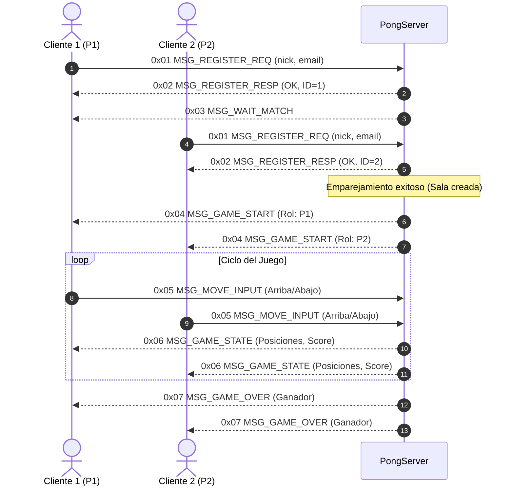

# Pong - Proyecto N°1
**Internet: Arquitectura y Protocolos**  
**Universidad EAFIT**

---

## 1. Introducción

El presente proyecto consiste en el diseño e implementación de un sistema distribuido para el juego clásico **Pong**, basado en una arquitectura **Cliente/Servidor**. El objetivo principal es aplicar conceptos fundamentales de programación en red, concurrencia mediante hilos y la definición e implementación formal de un protocolo de comunicación en la capa de aplicación denominado **`MyAppGameProtocol`**.

El sistema cuenta con un servidor autoritativo encargado de mantener el estado del juego, arbitrar las reglas, gestionar salas simultáneas para múltiples parejas de jugadores y registrar todas las operaciones en consola y en un archivo de bitácora (*log*). Los clientes capturan la entrada del usuario y renderizan en pantalla el estado provisto por el servidor.

---

## 2. Desarrollo

### 2.1 Arquitectura del Sistema
El sistema se basa en una arquitectura **Cliente/Servidor Centralizado** con roles claramente delimitados. Para más detalle técnico, ver [docs/architecture.md](docs/architecture.md).

#### Servidor: Arquitectura por Capas (Servidor Autoritativo)
* **Capa de Red (`src/net`):** Implementada con la API nativa de **Berkeley Sockets** mediante `libc`.
* **Capa de Protocolo (`src/protocol`):** Serialización y deserialización binaria de `MyAppGameProtocol`.
* **Capa de Matchmaking (`src/game`):** Registro de usuarios y emparejamiento concurrente de $n$ partidas.
* **Capa de Juego y Concurrencia (`src/game`):** Bucle de física autoritativa ejecutado en hilos independientes (`threads`).
* **Capa Transversal:** Logger concurrente hacia consola y archivo de bitácora (`<Log File>`).

#### Cliente: Patrón MVC (Model - View - Controller)
* **Modelo (Model):** Almacena pasivamente las coordenadas y puntajes recibidos del servidor.
* **Vista (View):** Renderizado gráfico en pantalla (paletas, pelota, marcador y pantallas de estado).
* **Controlador (Controller):** Captura entradas de teclado del usuario y coordina la actualización del modelo.
* **Servicio de Red (Network Service):** Conexión por socket y empaquetado binario de peticiones al servidor.


### 2.2 Elección del Protocolo de Transporte
* **Protocolo seleccionado:** `SOCK_STREAM` (TCP) *(o justificación de TCP/UDP según diseño)*.
* **Justificación:** 
  * Se requiere entrega confiable y ordenada para el establecimiento de la sesión, registro de jugadores, emparejamiento y eventos críticos del juego (inicio, goles, fin de partida).
  * La semántica de flujo continuo orientada a conexión garantiza la detección oportuna de desconexiones de cualquiera de los dos jugadores en la partida.

### 2.3 Especificación de `MyAppGameProtocol` (Protocolo Binario)
El protocolo opera en la capa de aplicación sobre sockets de transporte y utiliza una **codificación binaria** para máxima eficiencia en ancho de banda y velocidad de procesamiento.

#### 2.3.1 Formato General de Trama (Header + Payload)
Todos los paquetes intercambiados comparten una cabecera fija de 3 bytes:

| Campo | Offset (bytes) | Tamaño | Tipo | Descripción |
| :--- | :---: | :---: | :---: | :--- |
| `OpCode` | 0 | 1 byte | `uint8` | Identificador del tipo de mensaje |
| `Payload_Len` | 1 | 2 bytes | `uint16` (Big-Endian) | Longitud en bytes de la carga útil |

#### 2.3.2 Catálogo de Mensajes (`OpCodes`)

| OpCode | Nombre | Origen $\rightarrow$ Destino | Descripción |
| :---: | :--- | :---: | :--- |
| `0x01` | `MSG_REGISTER_REQ` | Cliente $\rightarrow$ Servidor | Petición de registro (Nickname, Email). |
| `0x02` | `MSG_REGISTER_RESP` | Servidor $\rightarrow$ Cliente | Respuesta al registro (código de estado y Player ID). |
| `0x03` | `MSG_WAIT_MATCH` | Servidor $\rightarrow$ Cliente | Notificación de espera de rival en sala. |
| `0x04` | `MSG_GAME_START` | Servidor $\rightarrow$ Cliente | Inicio de partida y rol asignado (Jugador 1 o 2). |
| `0x05` | `MSG_MOVE_INPUT` | Cliente $\rightarrow$ Servidor | Movimiento de paleta (`0x00`: quieto, `0x01`: arriba, `0x02`: abajo). |
| `0x06` | `MSG_GAME_STATE` | Servidor $\rightarrow$ Clientes | Actualización periódica de coordenadas de paletas, pelota y marcador. |
| `0x07` | `MSG_GAME_OVER` | Servidor $\rightarrow$ Clientes | Notificación de fin de juego y ganador. |

#### 2.3.3 Estructura Detallada del Estado del Juego (`0x06` - `MSG_GAME_STATE`)
Carga útil de 10 bytes:
* `Paddle1_Y` (2 bytes, `uint16`): Coordenada $Y$ de la paleta izquierda.
* `Paddle2_Y` (2 bytes, `uint16`): Coordenada $Y$ de la paleta derecha.
* `Ball_X` (2 bytes, `uint16`): Coordenada $X$ de la pelota.
* `Ball_Y` (2 bytes, `uint16`): Coordenada $Y$ de la pelota.
* `Score_P1` (1 byte, `uint8`): Puntuación del Jugador 1.
* `Score_P2` (1 byte, `uint8`): Puntuación del Jugador 2.

### 2.4 Diagrama de Secuencia (Flujo del Protocolo)


### 2.5 Compilación y Ejecución
El proyecto incluye un `Makefile` para automatizar el ciclo de vida del ejecutable.

#### Compilación:
```bash
make
```

#### Ejecución del Servidor:
```bash
./server <PORT> <Log File>
```
*Ejemplo:*
```bash
./server 8080 server.log
```

---

## 3. Conclusiones
*(Sección a completar durante la fase final de pruebas y despliegue en AWS Academy)*.

---

## 4. Referencias
* Hall, B. *Beej's Guide to Network Programming - Using Internet Sockets*. https://beej.us/guide/bgnet/
* Hall, B. *Beej's Guide to C Programming*. https://beej.us/guide/bgc/
* GeeksforGeeks. *TCP Server-Client Implementation in C*. https://www.geeksforgeeks.org/tcp-server-client-implementation-in-c/
