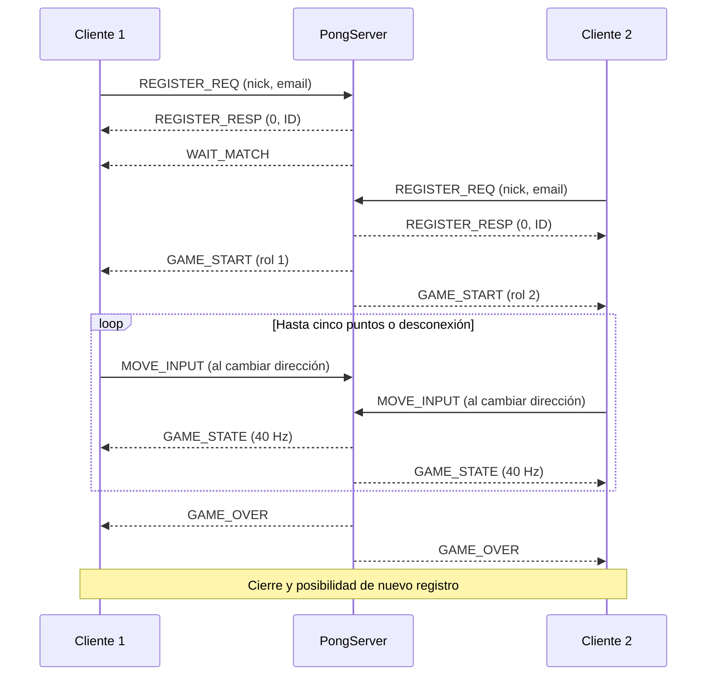

# Pong — Proyecto N.º 1

**Internet: Arquitectura y Protocolos · Universidad EAFIT**
Servidor Rust con sockets Berkeley/Linux y cliente gráfico Python/Pygame.
**Rama de trabajo: Development** (D mayúscula).

## 1. Introducción

Pong Online implementa un juego distribuido con arquitectura cliente/servidor.
Cada cliente registra un apodo y un correo, espera un rival y controla una paleta.
El servidor es autoritativo: calcula movimientos, colisiones, goles y ganador,
y transmite el estado a ambos jugadores. Varias parejas juegan simultáneamente.

La implementación usa **MyAppGameProtocol**, un protocolo binario propio sobre TCP.
Las operaciones de red del servidor llaman directamente a la API Berkeley mediante
`libc`; no usan frameworks ni sockets Rust de alto nivel. El cliente utiliza el
módulo estándar `socket` de Python.

## 2. Desarrollo

### 2.1 Funcionalidades y reglas

- Registro por formulario o argumentos; validación en ambos extremos.
- Apodos únicos entre sesiones activas, sin distinguir mayúsculas/minúsculas.
- Emparejamiento automático en orden de registro aceptado; una sala por pareja.
- Cancha de 800 × 600, paletas de 15 × 90 y pelota de 12 × 12.
- Simulación a **40 ticks/s**; renderizado del cliente a 60 FPS.
- Flechas arriba/abajo o W/S. Mantener una tecla conserva la dirección;
  soltarla o quitar el foco de la ventana detiene la paleta.
- Paletas a 7 píxeles/tick, siempre dentro de la cancha.
- Pelota: incremento horizontal del 5 % por rebote, hasta 12 píxeles/tick.
  El punto de impacto determina la velocidad vertical.
- Gana quien llega a **5 puntos**. Si un jugador se desconecta, gana el rival
  conectado; si ninguno permanece, se cancela la sala.
- R al terminar o ante un error vuelve al registro; Esc cierra el cliente.
- Log concurrente en consola y archivo: conexiones, registros, movimientos,
  estados enviados, goles, resultados y errores.
- Cierre ordenado con Ctrl+C o SIGTERM.

### 2.2 Arquitectura

| Componente | Responsabilidad |
|---|---|
| `pong_server/src/net/socket.rs` | API Berkeley, lecturas/envíos completos y propiedad de descriptores |
| `pong_server/src/protocol/` | Tipos de mensajes, formato binario y validación |
| `pong_server/src/main.rs` | Argumentos, registro, emparejamiento, señales y supervisión |
| `pong_server/src/game/player.rs` | Sesiones, reserva de IDs/apodos y dirección atómica |
| `pong_server/src/game/room.rs` | Un hilo por sala, difusión del estado y resultado |
| `pong_server/src/game/state.rs` | Física y reglas autoritativas |
| `pong_server/src/utils/logger.rs` | Bitácora serializada entre hilos |
| `pong_client/model/` | Estado pasivo; no simula física |
| `pong_client/view/` | Formulario, cancha, espera, errores y resultado |
| `pong_client/controller/` | Entrada y actualización del modelo |
| `pong_client/net/` | Conexión/recepción en un hilo y cola de eventos |
| `pong_client/protocol.py` | Codificación y validación del cliente |

El servidor mantiene un hilo por conexión y otro por sala. Solo el hilo de sala
modifica su estado físico; cada lector guarda la dirección deseada en un atómico.
Enviar más movimientos no acelera la paleta. Los sockets tienen propiedad compartida
con `Arc`, cierre por RAII y `shutdown` para despertar lectores al finalizar.

Hay hasta **255 conexiones reservadas**, incluidas las pendientes de registro:
como máximo 127 partidas simultáneas y un jugador en espera. Es un límite de diseño
del ID de un byte, no una medición de rendimiento. El ID se libera al salir.

El cliente modifica/renderiza el modelo solo en el hilo principal. El hilo de red
entrega eventos mediante una cola. Diagramas: [docs/architecture.md](docs/architecture.md).

### 2.3 Transporte elegido: TCP (`SOCK_STREAM`)

TCP conserva el orden y entrega de registros, movimientos y resultados. Cada estado
ocupa 13 bytes: aproximadamente 520 bytes/s por cliente a 40 Hz, sin contar cabeceras
TCP/IP ni otros mensajes. Se activa `TCP_NODELAY`.

Una retransmisión TCP puede retrasar estados recientes (bloqueo de cabeza de línea).
Para este alcance académico se prioriza la entrega ordenada y la simplicidad;
no se implementan predicción ni compensación de latencia.

TCP **no conserva fronteras de mensajes**. Ambos extremos leen exactamente la
cabecera y la carga, incluso si llegan fragmentadas o varias tramas llegan juntas.
El servidor repite envíos parciales y maneja interrupciones.

### 2.4 MyAppGameProtocol

#### Servicio y representación

Permite registrar un perfil, esperar rival, recibir un rol, enviar una dirección
y recibir estados/resultados. Los enteros multibyte usan **big-endian**.
Las longitudes de texto cuentan **bytes UTF-8**, no caracteres. No hay JSON,
delimitadores de texto ni relleno.

Cabecera común de **3 bytes**:

| Campo | Offset | Tamaño | Descripción |
|---|---:|---:|---|
| OpCode | 0 | 1 | Tipo de mensaje |
| Payload_Len | 1 | 2 | Número exacto de bytes de carga útil |

#### Vocabulario completo

| Código | Mensaje | Sentido | Carga útil |
|---|---|---|---|
| `0x01` | `MSG_REGISTER_REQ` | C → S | Nick_Len u8 + Nick + Email_Len u8 + Email |
| `0x02` | `MSG_REGISTER_RESP` | S → C | Status u8 + Player_ID u8 |
| `0x03` | `MSG_WAIT_MATCH` | S → C | Vacía |
| `0x04` | `MSG_GAME_START` | S → C | Role u8: 1 izquierda, 2 derecha |
| `0x05` | `MSG_MOVE_INPUT` | C → S | Direction u8: 0 quieto, 1 arriba, 2 abajo |
| `0x06` | `MSG_GAME_STATE` | S → C | Cuatro u16 y dos u8; estructura siguiente |
| `0x07` | `MSG_GAME_OVER` | S → C | Winner u8: 1 o 2; 0 cancelación |

`Status`: **0** aceptado, **1** registro inválido/protocolo incorrecto,
**2** apodo ocupado, **3** capacidad agotada. En rechazo, Player_ID es 0 y se
cierra la conexión; en éxito pertenece a 1..255. Un servidor lleno puede rechazar
inmediatamente después de aceptar la conexión.

El apodo ocupa 1..24 bytes UTF-8, sin controles ni espacios en los extremos.
El correo ocupa 3..254 bytes ASCII, sin controles/espacios, con un único `@`, partes
no vacías y un dominio con punto que no empieza ni termina en punto. La validación
es sintáctica y no verifica que el correo exista. El perfil vive en memoria durante
la sesión; no hay cuentas ni autenticación.

`MSG_GAME_STATE` contiene exactamente **10 bytes de carga**:

| Campo | Offset dentro de la carga | Tipo |
|---|---:|---|
| Paddle1_Y | 0 | u16 |
| Paddle2_Y | 2 | u16 |
| Ball_X | 4 | u16 |
| Ball_Y | 6 | u16 |
| Score_P1 | 8 | u8 |
| Score_P2 | 9 | u8 |

Las coordenadas son la esquina superior izquierda. Las paletas tienen Y en 0..510;
la pelota tiene Y en 0..588. Ball_X se limita a cero al serializar la pelota que
está saliendo por la izquierda. El cliente no modifica velocidades ni puntos.

Ejemplos: bajar es `05 00 01 02`; esperar rival es `03 00 00`.
Registro de `Ana` y `a@b.com`:
`01 00 0C 03 41 6E 61 07 61 40 62 2E 63 6F 6D`.

#### Procedimientos y fallos

1. El cliente conecta y envía una única solicitud de registro.
2. El servidor valida y responde con estado e ID.
3. Sin rival, envía WAIT_MATCH. El segundo jugador puede recibir GAME_START
   directamente después del registro.
4. Ambos reciben GAME_START antes de los estados. Solo entonces se admite MOVE_INPUT.
5. La dirección persiste hasta recibir otra. El cliente envía cambios y el servidor
   aplica la dirección una vez por tick.
6. Cada tick genera GAME_STATE. Tras el punto decisivo se envía el marcador final
   y luego GAME_OVER.
7. GAME_OVER precede al cierre. El resultado queda visible. Otra partida requiere
   nueva conexión y registro.
8. La desconexión en espera elimina al jugador de la cola; durante el juego gana
   el rival conectado. Un corte del servidor muestra un error en el cliente.

Se rechazan opcodes, longitudes, UTF-8, direcciones y fases inválidas. No se
reservan cargas arbitrarias: el registro tiene como máximo 280 bytes; un movimiento,
exactamente uno. El registro completo tiene plazo de 5 segundos y una trama
iniciada después del registro debe completarse en 5 segundos. Los envíos tienen
plazo de 2 segundos. Más de 240 movimientos en una ventana de un segundo termina
la sesión.

Un jugador puede esperar sin enviar movimientos. Los sockets usan keepalive y
`TCP_USER_TIMEOUT` para acotar conexiones que dejan de responder. Durante el juego,
el cliente detecta un servidor sin respuestas con un plazo de 5 segundos de espera
del primer byte y 5 segundos para completar una trama iniciada. La detección de
una caída de red no es instantánea.



### 2.5 Requisitos e instalación

**Servidor:** Linux (Ubuntu 22.04/24.04 o Ubuntu en WSL), compilador C/linker,
Make y Rust 1.87 o posterior con Cargo. `Cargo.lock` fija las dependencias.
El servidor no se compila directamente en Windows: utiliza la API Linux Berkeley.

En Ubuntu:

```bash
sudo apt update
sudo apt install -y build-essential curl python3 python3-venv
curl --proto '=https' --tlsv1.2 -sSf https://sh.rustup.rs -o /tmp/rustup-init.sh
sh /tmp/rustup-init.sh -y --profile minimal --component rustfmt --component clippy
source "$HOME/.cargo/env"
```

**Cliente:** Python 3.10 o posterior y Pygame 2.6.1; Windows o Linux con escritorio.

```bash
python3 -m venv .venv
.venv/bin/python -m pip install -r pong_client/requirements.txt
```

### 2.6 Compilación y ejecución

Desde la raíz, en `Development`:

```bash
git branch --show-current
make
./server 8080 server.log
```

Se conserva la interfaz exigida: **`./server <PORT> <Log File>`**. Puerto: 1..65535.
Puerto ocupado o bitácora inaccesible producen salida con error. El servidor
escucha en todas las interfaces IPv4. Ctrl+C lo detiene.

Abre dos clientes en terminales distintas y usa apodos diferentes:

```bash
.venv/bin/python pong_client/main.py
```

O conecta directamente:

```bash
.venv/bin/python pong_client/main.py 127.0.0.1 8080 Ana ana@eafit.edu.co
.venv/bin/python pong_client/main.py 127.0.0.1 8080 Luis luis@eafit.edu.co
```

Para otra máquina, sustituye `127.0.0.1` por la IPv4 del servidor.
`python pong_client/main.py --help` muestra los argumentos.

#### Inicio rápido en tu PC Windows

En PowerShell, desde `C:\Users\Usuario\OneDrive\Documents\GitHub\Pong`:

```powershell
# Terminal 1: servidor en Ubuntu/WSL
powershell -ExecutionPolicy Bypass -File .\scripts\start-server.ps1

# Terminal 2: cliente con formulario (prepara .venv y Pygame si faltan)
powershell -ExecutionPolicy Bypass -File .\scripts\start-client.ps1

# Terminal 3: segundo cliente
powershell -ExecutionPolicy Bypass -File .\scripts\start-client.ps1
```

El cliente admite `-Server`, `-Port`, `-Nickname` y `-Email`; el servidor admite
`-Port` y `-LogFile`. ExecutionPolicy Bypass se aplica solo a ese proceso.
Si localhost no conecta desde Windows a WSL, consulta `wsl -d Ubuntu -- hostname -I`
y usa la IPv4 de Ubuntu. Verifica también que coincidan puerto y servidor.

### 2.7 Pruebas

```bash
source "$HOME/.cargo/env"
make check        # formato y Clippy sin advertencias
make test         # Rust + cliente sin GUI + servidor TCP real
make test-ui PYTHON=.venv/bin/python
```

La prueba gráfica usa SDL sin ventana y guarda pantallas en `test-results/ui/`.
En Windows:

```powershell
.\.venv\Scripts\python.exe -m unittest discover -s tests -p test_client.py -v
.\.venv\Scripts\python.exe -m unittest discover -s tests -p test_ui.py -v
```

Cobertura y resultados: [docs/testing.md](docs/testing.md).
GitHub Actions verifica pushes y pull requests hacia `Development`. El flujo
queda configurado localmente y se ejecutará al subir los cambios.

### 2.8 AWS Academy

[docs/aws-deployment.md](docs/aws-deployment.md) explica instancia Ubuntu, grupo
de seguridad, compilación, servicio systemd, bitácora, prueba externa y parada.
Se incluyen `deploy/pong.service` y `deploy/pong.logrotate`.
**El despliegue AWS sigue pendiente:** todavía no hay instancia de Academy.

## 3. Conclusiones

La aplicación implementa un protocolo binario coherente entre Rust y Python
y conserva la autoridad del juego en el servidor. La simulación por sala y las
direcciones persistentes permiten partidas independientes sin vincular la velocidad
de las paletas a la frecuencia de mensajes.

Las pruebas locales verifican flujos normales y errores reproducibles, incluida
una partida completa. No sustituyen la demostración en AWS ni una medición de
rendimiento con 127 salas simultáneas.

El alcance es académico: perfiles en memoria, IPv4 y TCP, sin autenticación,
cifrado, persistencia, espectadores ni predicción. La bitácora contiene los perfiles
registrados; utiliza perfiles de prueba en las demostraciones.

## 4. Referencias

- [Enunciado](PDF-ProyectoN1-Pong.pdf).
- [Rust: instalación oficial](https://doc.rust-lang.org/book/ch01-01-installation.html).
- [libc](https://docs.rs/libc/).
- [Linux: recv(2)](https://man7.org/linux/man-pages/man2/recv.2.html).
- [Linux: send(2)](https://man7.org/linux/man-pages/man2/send.2.html).
- [Linux: socket(7)](https://man7.org/linux/man-pages/man7/socket.7.html).
- [Beej's Guide to Network Programming](https://beej.us/guide/bgnet/).
- [Python: socket](https://docs.python.org/3/library/socket.html).
- [Pygame](https://www.pygame.org/docs/).
- [AWS: grupos de seguridad](https://docs.aws.amazon.com/vpc/latest/userguide/security-group-rules.html).
