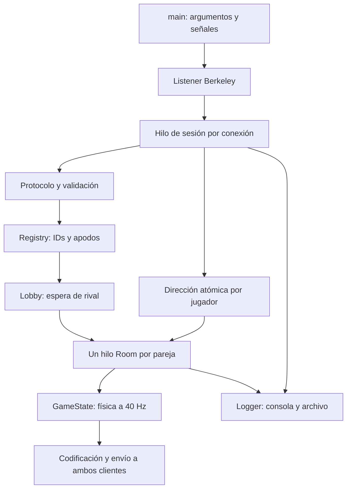
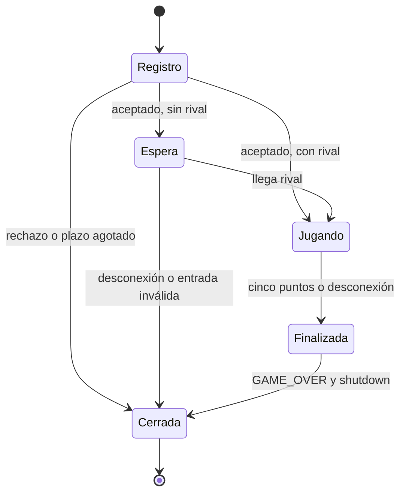
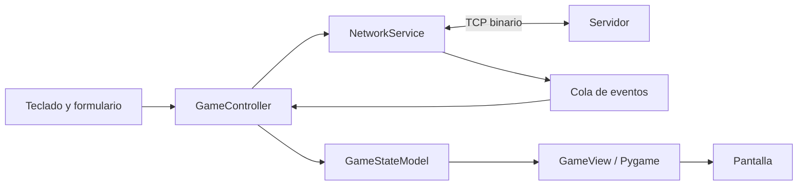

# Arquitectura y concurrencia

## Servidor autoritativo por capas

El ejecutable usa directamente sockets Berkeley mediante `libc`. Los tipos de
`net/socket.rs` encapsulan propiedad de descriptores y llamadas del sistema;
no delegan el transporte a `std::net::TcpStream`, Tokio ni frameworks.
`std::net::Ipv4Addr` solo formatea la dirección para la bitácora.

### Propiedad y sincronización

- Listener y stream poseen un `OwnedFd`: se cierra exactamente una vez.
  El stream se comparte mediante `Arc`.
- Un hilo de sesión es el único lector de cada cliente.
- La sesión escribe registro y WAIT_MATCH antes de publicar al jugador en la
  cola; después del emparejamiento, solo la sala escribe START/STATE/OVER.
- `Reservation` reserva el ID antes del registro y libera ID/apodo al destruirse.
  No hay desbordamiento ni vuelta silenciosa a cero.
- La cola usa una referencia débil: no retiene clientes que ya salieron.
- Dirección, conexión y fase son atómicas; la física pertenece al hilo de sala.
- Registro de nombres, cola y colección de hilos tienen mutexes separados.
- Los hilos finalizados se recolectan; sus manejadores no se acumulan.
- La bitácora serializa registros completos entre consola y archivo.
- Ctrl+C/SIGTERM marca una bandera; el bucle deja de aceptar, cierra los sockets
  con shutdown y espera la terminación de sesiones y salas.

Los plazos usan `poll` y reloj monotónico. `MSG_NOSIGNAL` evita que escribir a un
cliente cerrado termine todo el servidor. Un cliente lento puede retrasar su sala,
pero no las simulaciones de otras salas. El coste de la bitácora sí se comparte;
el límite de 255 conexiones no es una afirmación de rendimiento.

### Estados de sesión

Cada conexión corresponde a una sesión y como máximo una partida. La especificación
de mensajes, reglas y errores está en el README.

## Cliente MVC

La conexión y recepción corren fuera del hilo gráfico. El hilo de red no muta el
modelo ni llama a Pygame: entrega mensajes a una cola de tamaño acotado. El
controlador aplica hasta 128 eventos por fotograma, valida las transiciones,
envía cambios de dirección y dibuja a 60 FPS.

El formulario admite servidor, puerto, apodo y correo. Las longitudes se validan
por bytes UTF-8. Al perder foco se envía dirección cero. Un EOF después del
resultado no sustituye la pantalla de victoria/derrota por error. R vuelve al
formulario; reconectar crea una nueva sesión.

## Física

Cada tick mueve las paletas y actualiza la pelota una vez. La colisión comprueba
el cruce de la cara de la paleta para evitar atravesarla a alta velocidad. La
velocidad horizontal está acotada; la vertical depende del punto de impacto.
Los bordes superior/inferior reflejan la trayectoria y cada gol recentra la pelota.
El cliente no hace predicción, interpolación ni sincronización de relojes.
