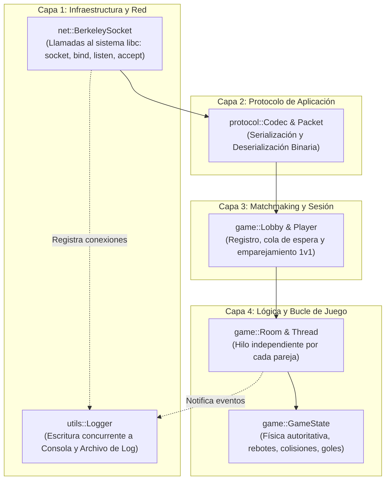
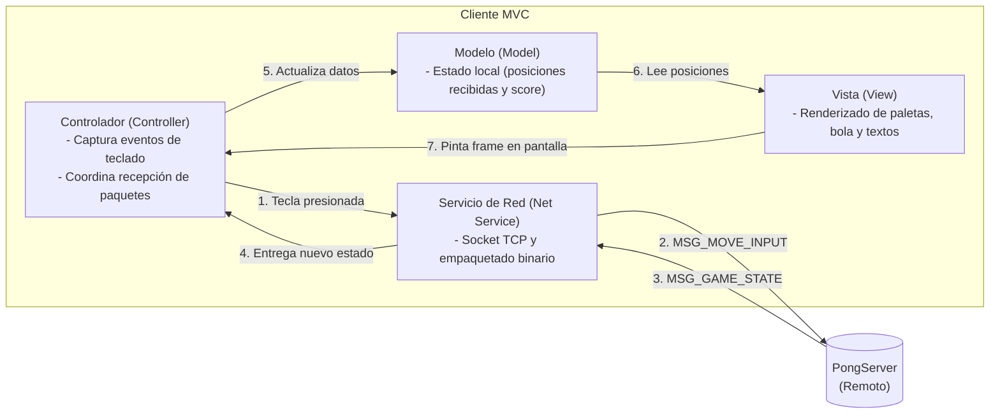

# Arquitectura del Sistema - Pong en Red

Este documento describe detalladamente los patrones arquitectónicos implementados tanto en el **Servidor** como en el **Cliente**, garantizando una estricta separación de responsabilidades y modularidad.

---

## 1. Servidor: Arquitectura por Capas (Servidor Autoritativo)

Para el servidor se implementa una **Arquitectura por Capas (*Layered Architecture*)** bajo el modelo de **Servidor Autoritativo**, donde el servidor tiene la verdad absoluta del estado del juego y la física, mientras que los clientes son terminales de entrada y renderizado.

### Descripción de Capas del Servidor:

1. **Capa de Red (`src/net`):**
   * Encapsula las llamadas nativas de la API de Berkeley (`socket`, `bind`, `listen`, `accept`, `recv`, `send`, `close`) mediante el crate `libc`.
   * Aísla los bloques `unsafe` y los punteros crudos del resto del código.
2. **Capa de Protocolo (`src/protocol`):**
   * Define la estructura de los paquetes (`Packet`, `OpCode`).
   * Convierte flujos de bytes crudos en estructuras de datos de Rust (y viceversa) garantizando el formato de red *Big-Endian*.
3. **Capa de Sesiones y Emparejamiento (`src/game/player.rs`, `lobby.rs`):**
   * Gestiona la llegada de jugadores, su registro (`nickname`, `email`) y los empareja en parejas de dos.
4. **Capa de Lógica del Juego (`src/game/state.rs`, `room.rs`):**
   * Cada partida corre en su propio **hilo de ejecución (`std::thread`)**.
   * Calcula a 30/60 ticks por segundo la posición de la pelota, colisiones con las paredes/paletas y la puntuación.
5. **Capa Transversal de Bitácora (`src/utils/logger.rs`):**
   * Satisface el requerimiento `./server <PORT> <Log File>`. Imprime en consola y persiste en el archivo de log con marcas de tiempo.

---

## 2. Cliente: Patrón MVC (Model - View - Controller)

Para la aplicación cliente se utiliza el patrón clásico **MVC**, apoyado por un **Servicio de Red** para la comunicación con el servidor:

### Componentes de MVC en el Cliente:

1. **Modelo (`model/game_state.py`):**
   * Almacena pasivamente las variables del juego: coordenadas de las paletas, posición de la pelota y marcador.
   * **No calcula física ni rebotes:** solo almacena el estado autoritativo que dicta el servidor.
2. **Vista (`view/renderer.py`):**
   * Utiliza la librería gráfica (ej. Pygame).
   * Se encarga de dibujar el fondo, la red divisoria, los rectángulos de las paletas, la bola blanca y los textos en pantalla (pantalla de registro, sala de espera, marcador y fin de juego).
3. **Controlador (`controller/game_controller.py`, `input_handler.py`):**
   * Captura los eventos del teclado (flechas $\uparrow / \downarrow$ o teclas $W / S$).
   * Pide al Servicio de Red enviar el comando binario al servidor.
   * Contiene el bucle principal de la aplicación.
4. **Servicio de Red (`net/network_service.py`):**
   * Maneja el socket del cliente.
   * Usa `struct.pack` y `struct.unpack` para codificar y decodificar los bytes del protocolo `MyAppGameProtocol`.
